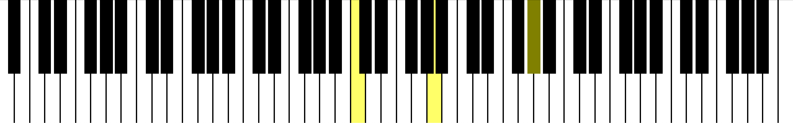

# MIDI Piano

This demo shows how to use
[InputEventMIDI](https://docs.godotengine.org/en/latest/classes/class_inputeventmidi.html)
by creating a piano that can be controlled by a MIDI device.
This is known to work with a Yamaha MX88.

The piano can also be controlled by clicking on the keys, or by
manually calling the activate and deactivate methods on each key.

Note that MIDI output is not yet supported in Godot, only input works.

Language: GDScript

Renderer: Compatibility

Check out this demo on the asset library: https://godotengine.org/asset-library/asset/1292

## Screenshots

--------------------------------

Wishlist and projects.

1. Read and write files in midi (*.MID) format. I have explored this a bit and it seems to be pretty
doable. I have added an example from a different project: "Control.gd". This creates a sample file.

This is the very difficult to understand spec:

https://www.music.mcgill.ca/~ich/classes/mumt306/StandardMIDIfileformat.html

Very helpful is this site that lets you build and test out *.mid files:

https://signal.vercel.app/

Essentially, the initial header describes a single-track format, then there are some parts that we wouldn't necessarily have to change (except for one record-length field), finally we have a series of note-on and note-off records. I experimented with changing some by hand and re-running on the signal app (above) and it worked great. So we don't need to invent a new way to store music data as a file. 

2.  Reading Web2 and Web3 data with JSON Rest-API support. I figured out how to do this and uploaded an example as a different project:

https://github.com/johnrigler/godotHTTPRequest

It pumps an ton of data into the console, basically the last transaction for one of my addresses as seen from the block explorer polygonscan.

3.  Support for WebRTC. This one is big. I know that this project is on Godot V4. I happened to find some example WebRTC projects in Godot V3, and posts claiming that it is possible/easier in vesion 4. This will
allow two different things to happen. First, we could use WebRTC to build a simple way for players to communicate
with each other. It is not recommended for the most intense 3D FPS games, but will work for us (at least 
for some things like sending emoticons or bundles of songs). Also, and this part is a bit tricky, I believe
that we can spawn off a browser instance from the game and pass a WebRTC keyphrase as a parameter:

https://www.youtube.com/watch?v=t2h3NjRQu0A  <--- using OS.execute() to open a web browser that points to javascript and initializes it
all at once. 

Then the game would be able to communicate with a small Web App. on the player's desktop. This hack would allow us to 
import javascript support quite easily and even fire off Metamask transactions for authentication or token 
transfers. WebRTC is a pretty big journey, but I have tested out much of this already. A very helpful
resource is a Javascript example:

https://jmcker.github.io/Peer-to-Peer-Cue-System/

One of my friends, Brian Click, made the "Paddle of Doom" pong game using this. Each player must prove that they
own an Orthoverse (orthoverse.io) token to play. It was a blockchain POC.

